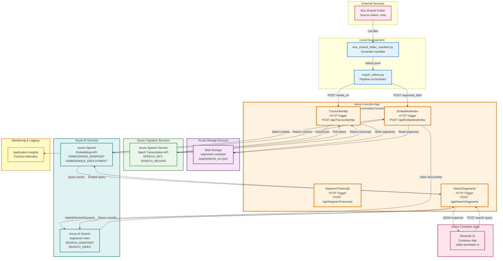

# Video Annotator - Azure Infrastructure Diagram



## Azure Services Overview

### Azure Function App
**Resource**: `video-annotator-function`  
**Runtime**: Python 3.11+  
**Functions**:
- **TranscribeHttp** - HTTP trigger, handles batch transcription submission and polling
- **SegmentTranscript** - HTTP trigger, segments transcripts into 30-second clips
- **EmbedAndIndex** - HTTP trigger, generates embeddings and indexes segments
- **SearchSegments** - HTTP trigger, performs hybrid/vector/keyword search

**Configuration** (App Settings):
- `SPEECH_KEY`, `SPEECH_REGION`, `SPEECH_ENDPOINT`, `SPEECH_API_VERSION`
- `AZURE_STORAGE_ACCOUNT`, `AZURE_STORAGE_KEY`
- `SEGMENTS_CONTAINER` (default: "segments")
- `EMBEDDINGS_ENDPOINT`, `EMBEDDINGS_KEY`, `EMBEDDINGS_DEPLOYMENT`, `EMBEDDINGS_API_VERSION`
- `SEARCH_ENDPOINT`, `SEARCH_ADMIN_KEY`, `SEARCH_QUERY_KEY`, `SEARCH_INDEX` (default: "segments")

### Azure Storage Account
**Service**: Blob Storage  
**Container**: `segments`  
**Blob Format**: `segments/vid_xxx.json`  
**Content**: JSON files containing video segments with transcript text, timestamps, and metadata

### Azure Speech Service
**Service**: Cognitive Services - Speech  
**API**: Batch Transcription API  
**Features**: 
- Word-level timestamps
- Multi-channel support (uses channel 0)
- TTL: 24 hours for transcription jobs

### Azure OpenAI
**Service**: Azure OpenAI Service  
**API**: Embeddings API  
**Deployment**: Custom embedding model deployment  
**Usage**: Generates vector embeddings for segment text and search queries

### Azure AI Search
**Service**: Azure Cognitive Search  
**Index**: `segments`  
**Features**:
- Hybrid search (keyword + vector)
- Vector search support
- Keyword search support
- Document fields: `segment_key`, `video_id`, `segment_id`, `start_ms`, `end_ms`, `text`, `embedding`

### Azure Container Apps
**Resource**: `video-annotator-ui`  
**Runtime**: Python Streamlit  
**Configuration**:
- Environment variables: `SEARCH_FN_URL`, `DEFAULT_MODE`, `DEFAULT_TOP`, `DEFAULT_K`
- Scaling: 0-1 replicas (scale to zero enabled)

### Application Insights
**Service**: Monitoring and Telemetry  
**Usage**: Function App logging, performance monitoring, error tracking

## Authentication & Security

- **Function App**: Function-level auth keys (`?code=...` in URLs)
- **Storage**: Storage account key for read/write access
- **Speech Service**: API key authentication
- **OpenAI**: API key authentication
- **AI Search**: Admin key (indexing) and Query key (search)
- **Box API**: Developer token or OAuth tokens (stored locally in `.env`)

## Deployment

### Function App Deployment
```bash
func azure functionapp publish video-annotator-function
```

### Container App Deployment
```bash
az containerapp up --name video-annotator-ui --resource-group video-annotator-robot
```

## Resource Group
**Name**: `video-annotator-robot`  
**Location**: `eastus` (default)
