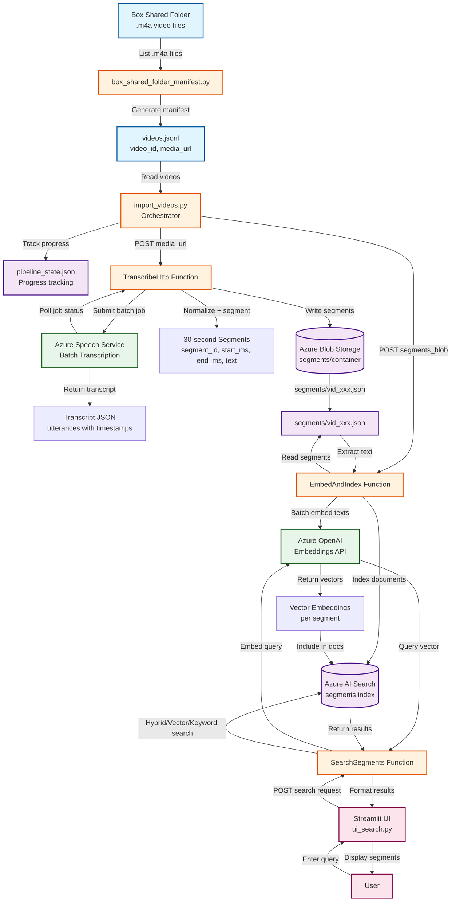

# Video Annotator - Data Flow Diagram

## Key Components

### Ingestion Pipeline
1. **Box Shared Folder** → Contains source `.m4a` video files
2. **box_shared_folder_manifest.py** → Enumerates videos and generates `videos.jsonl`
3. **import_videos.py** → Orchestrates the entire pipeline, tracks progress in `pipeline_state.json`

### Transcription & Segmentation
4. **TranscribeHttp Function** → Submits batch transcription jobs to Azure Speech Service
5. **Azure Speech Service** → Processes audio and returns transcripts with word-level timestamps
6. **Segmentation** → Splits transcripts into 30-second segments (handled by `shared/segmenter.py`)
7. **Blob Storage** → Stores segment JSON files (`segments/vid_xxx.json`)

### Embedding & Indexing
8. **EmbedAndIndex Function** → Reads segments from Blob, generates embeddings, and indexes to Azure AI Search
9. **Azure OpenAI** → Generates vector embeddings for segment text
10. **Azure AI Search** → Stores indexed segments with embeddings for hybrid search

### Search & UI
11. **SearchSegments Function** → Handles search queries (keyword, vector, or hybrid mode)
12. **Streamlit UI** → Provides web interface for users to search indexed segments

## Data Formats

- **videos.jsonl**: `{"video_id": "vid_123", "media_url": "https://..."}`
- **segments JSON**: `{"video_id": "...", "segments": [{"segment_id": "0000", "start_ms": 0, "end_ms": 30000, "text": "..."}]}`
- **Search Index**: Documents with `segment_key`, `video_id`, `segment_id`, `text`, `embedding`, `start_ms`, `end_ms`
