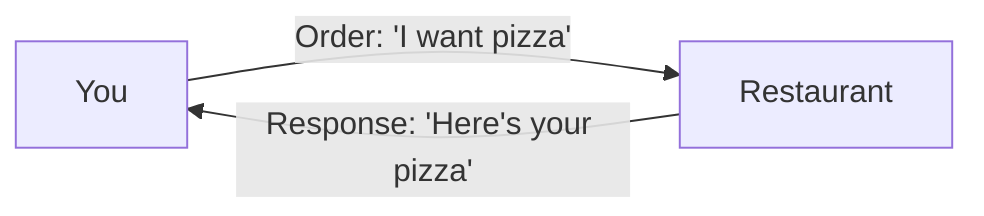
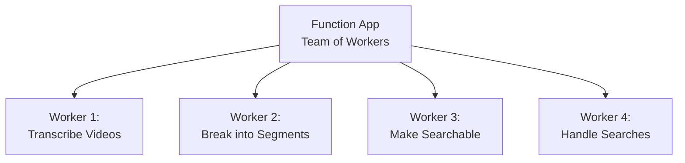
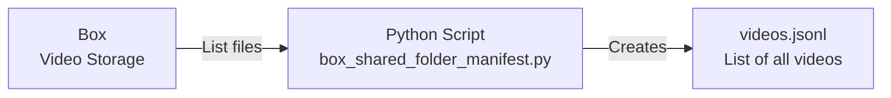
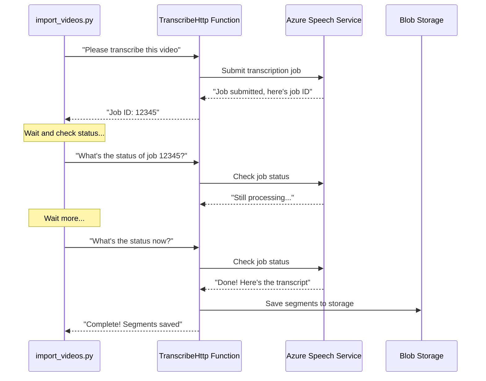
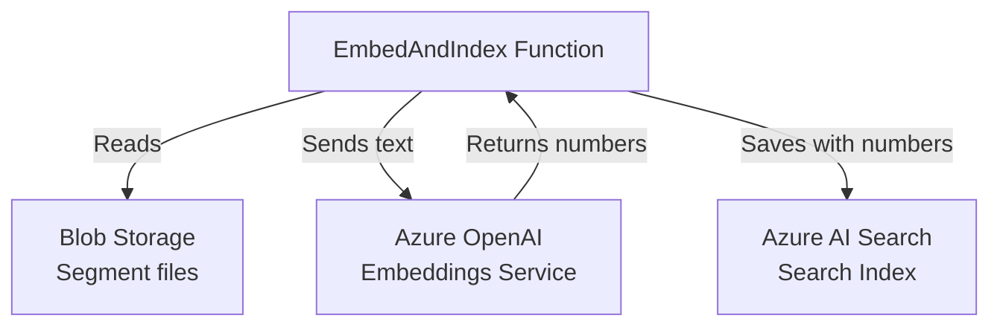
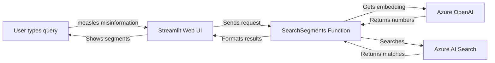
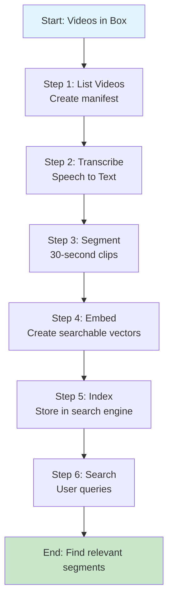
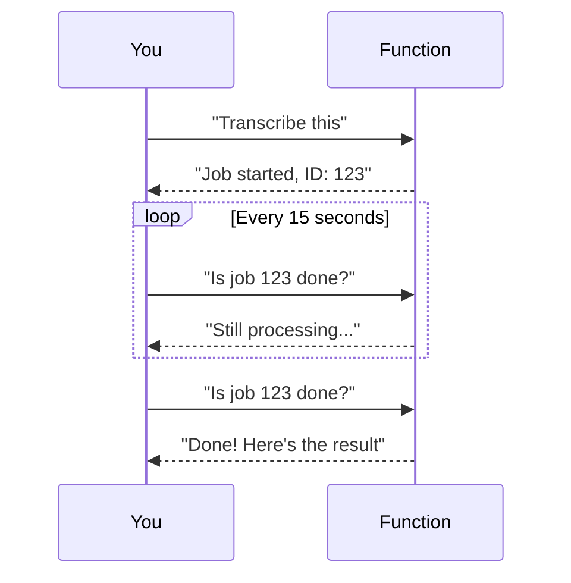

# Introduction to the Video Annotator Application

## What Does This Application Do?

Imagine you have hundreds of video files stored in Box (a cloud storage service), and you want to search through them to find specific topics or conversations. Instead of watching every video, this application:

1. **Takes videos** from Box
2. **Converts speech to text** (transcription)
3. **Breaks videos into 30-second segments** for easier searching
4. **Makes them searchable** using AI-powered search
5. **Provides a web interface** where you can type a question and find relevant video segments

Think of it like Google, but for video content - you can search for "measles misinformation" and it will show you exactly which 30-second segments of which videos discuss that topic.

## Understanding the Big Picture

Before diving into the technical details, let's understand some key concepts:

### What is Azure?

**Azure** is Microsoft's cloud computing platform. Think of it like renting computer services instead of buying your own computer:

- **Your computer at home**: You buy it, maintain it, pay for electricity, and it sits in your room
- **Azure (cloud)**: You rent computing power, storage, and services that run on Microsoft's servers somewhere else

**Why use Azure?**
- You don't need to buy expensive hardware
- Services scale automatically (handle more work when needed)
- Microsoft handles maintenance and security
- You only pay for what you use

### What are Web Services and APIs?

A **web service** is like a restaurant where you place an order:



In our application:
- **You (or your code)** sends a request: "Transcribe this video"
- **The web service** processes it and sends back: "Here's the transcript"

An **API (Application Programming Interface)** is the menu at that restaurant - it tells you:
- What you can order (available functions)
- How to place your order (what format to send)
- What you'll get back (response format)

### What is an Azure Function App?

An **Azure Function App** is like having a team of specialized workers, each with a specific job:



Each **function** is like one worker:
- They wait for instructions (HTTP requests)
- They do their specific job
- They return results
- They only work when needed (you don't pay when they're idle)

**Key benefits:**
- **Serverless**: You don't manage servers - Azure does
- **Pay-per-use**: You only pay when functions run
- **Scalable**: Automatically handles more requests if needed

## How the Application Works: Step by Step

Let's walk through what happens when you process a video:

### Step 1: Getting the List of Videos



**What happens:**
- A Python script connects to Box
- It finds all `.m4a` video files
- It creates a list file (`videos.jsonl`) with each video's ID and download URL

**Why this step?**
- We need to know which videos to process
- The list acts like a to-do list for the next steps

### Step 2: Transcribing Videos



**What happens:**
1. `import_videos.py` (orchestrator script) sends a video URL to the **TranscribeHttp** function
2. The function asks **Azure Speech Service** to transcribe the video
3. Speech Service processes the audio (this takes time)
4. The orchestrator keeps checking: "Is it done yet?" (polling)
5. When done, the transcript is broken into 30-second segments
6. Segments are saved to **Azure Blob Storage** (like cloud file storage)

**Key concepts:**
- **Polling**: Like checking your mailbox repeatedly - you keep asking "is there mail yet?"
- **Blob Storage**: Azure's file storage system (like Google Drive, but for applications)

### Step 3: Making Videos Searchable



**What happens:**
1. The **EmbedAndIndex** function reads the segment files from storage
2. For each segment's text, it asks **Azure OpenAI** to create an "embedding"
   - An **embedding** is like a fingerprint - a list of numbers that represents the meaning of the text
   - Similar meanings have similar numbers
3. The segments (with their embeddings) are saved to **Azure AI Search**
   - This is like creating an index in a book, but much more powerful

**Why embeddings?**
- Regular search: "Find the word 'measles'" - only finds exact matches
- Embedding search: "Find content about measles" - finds related concepts even if the word isn't used

### Step 4: Searching Videos



**What happens:**
1. User types a search query in the web interface
2. The **SearchSegments** function:
   - Converts the query to an embedding (numbers)
   - Searches the index for similar embeddings
   - Returns matching segments with timestamps
3. The web interface displays results showing:
   - Which video
   - Which 30-second segment
   - The transcript text
   - Relevance score

## The Complete Flow: Simple View

Here's how everything connects:



## Understanding the Components

### Azure Services We Use

1. **Azure Function App**
   - **What it is**: Container for our functions (workers)
   - **What it does**: Runs our code when requested
   - **Analogy**: A factory with specialized machines

2. **Azure Blob Storage**
   - **What it is**: Cloud file storage
   - **What it does**: Stores our segment JSON files
   - **Analogy**: A filing cabinet in the cloud

3. **Azure Speech Service**
   - **What it is**: AI service for speech-to-text
   - **What it does**: Converts audio to text with timestamps
   - **Analogy**: A professional transcriber

4. **Azure OpenAI**
   - **What it is**: AI service for embeddings
   - **What it does**: Converts text to numerical representations
   - **Analogy**: A translator that converts meaning to numbers

5. **Azure AI Search**
   - **What it is**: Search engine service
   - **What it does**: Stores and searches indexed content
   - **Analogy**: Google's search index, but for your data

6. **Azure Container Apps**
   - **What it is**: Service to run web applications
   - **What it does**: Hosts our Streamlit search interface
   - **Analogy**: A web server that runs your website

### Local Scripts

1. **box_shared_folder_manifest.py**
   - **What it does**: Lists videos from Box
   - **Runs**: On your computer (or a server)
   - **Output**: `videos.jsonl` file

2. **import_videos.py**
   - **What it does**: Orchestrates the entire pipeline
   - **Runs**: On your computer (or a server)
   - **What it manages**: Calls functions, tracks progress, handles errors

3. **ui_search.py**
   - **What it does**: Web interface for searching
   - **Runs**: In Azure Container Apps (or locally for testing)
   - **What users see**: Search box and results

## Key Concepts Explained Simply

### HTTP Requests (How Functions Are Called)

When you call a function, you're sending an **HTTP request**:

```
POST https://yourapp.azurewebsites.net/api/TranscribeHttp?code=SECRET_KEY
Content-Type: application/json

{
  "media_url": "https://box.com/video.m4a",
  "video_id": "vid_123"
}
```

**Breaking it down:**
- **POST**: The action (like "do something")
- **URL**: The address of the function
- **?code=SECRET_KEY**: Authentication (proves you're allowed)
- **Body**: The data you're sending (JSON format)

The function responds with:

```json
{
  "job_url": "https://speech.microsoft.com/jobs/12345",
  "status": "submitted"
}
```

### JSON (JavaScript Object Notation)

JSON is a way to structure data that both humans and computers can read:

```json
{
  "video_id": "vid_123",
  "segments": [
    {
      "segment_id": "0000",
      "start_ms": 0,
      "end_ms": 30000,
      "text": "Hello, this is a test."
    }
  ]
}
```

**Think of it like:**
- A dictionary with labeled boxes
- Each box can contain text, numbers, or other boxes
- Easy for programs to read and write

### Polling (Checking Status)

When you submit a transcription job, it doesn't finish immediately. The system uses **polling**:



**Why polling?**
- Transcription takes time (minutes, not seconds)
- We can't wait - we need to check periodically
- Like checking if your pizza is ready

### State Management

The `import_videos.py` script keeps track of progress in `pipeline_state.json`:

```json
{
  "vid_123": {
    "job_url": "https://...",
    "status": "indexed",
    "segments_blob": "segments/vid_123.json"
  },
  "vid_456": {
    "job_url": "https://...",
    "status": "running"
  }
}
```

**Why this matters:**
- If the script stops (error, computer shuts down), it can resume
- It knows which videos are done and which need work
- Like a bookmark in a book - you know where you left off

## Common Questions

### Q: Why not just run everything on my computer?

**A:** Several reasons:
1. **Scale**: Processing hundreds of videos needs lots of computing power
2. **Cost**: You'd need expensive hardware that sits idle most of the time
3. **Reliability**: Azure services are more reliable than a personal computer
4. **Specialized services**: Speech-to-text and AI embeddings require specialized hardware/software

### Q: What if a function fails?

**A:** The system is designed to handle failures:
- Functions return error messages
- `import_videos.py` tracks failures in state file
- You can re-run the script - it skips completed work
- Azure logs all errors for debugging

### Q: How much does this cost?

**A:** Azure charges based on usage:
- **Function Apps**: Pay per execution (very cheap for low usage)
- **Storage**: Pay per GB stored
- **Speech Service**: Pay per hour of audio transcribed
- **OpenAI**: Pay per embedding request
- **AI Search**: Pay per search operation

For a small project, costs are typically $10-50/month. For large scale, costs scale with usage.

### Q: Can I run this locally?

**A:** Partially:
- ✅ Scripts (`import_videos.py`, etc.) can run locally
- ✅ Functions can run locally with Azure Functions Core Tools
- ✅ UI can run locally with Streamlit
- ❌ You still need Azure services (Speech, OpenAI, etc.) - they're cloud-only

### Q: What programming languages are used?

**A:** 
- **Python**: All the code (functions, scripts, UI)
- **JSON**: Data formats (config, segments, state)
- **HTTP/JSON**: Communication between components

## Next Steps

Now that you understand the basics:

1. **Read the README files** to understand setup and usage
2. **Look at the code** - each file has documentation at the top
3. **Try running locally** - start with the test scripts
4. **Explore Azure Portal** - see your resources in action
5. **Check the diagrams** - `data-flow-diagram.md` and `azure-diagram.md` for detailed views

## Summary

This application is a **pipeline** that:
- Takes videos from Box
- Transcribes them using Azure Speech Service
- Breaks them into searchable segments
- Makes them searchable with AI embeddings
- Provides a web interface for searching

**Key takeaway**: Instead of one big program, we use many small, specialized services that work together. Each service does one thing well, and they communicate using HTTP requests and JSON data.

This is called a **microservices architecture** - breaking a big problem into smaller, manageable pieces that can be developed, deployed, and scaled independently.
